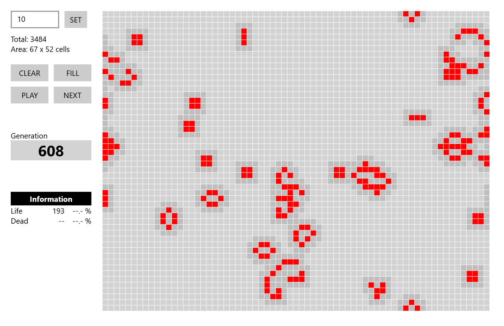

# GameOfLife
Certainly, there are already various solutions for the implementation of the "Game of Life". But at some point you reach the point where you ask yourself, how would I solve this and that was the start of this project.

<kbd>
  
</kbd>

## How it works
Run the application, set the cell width in pixel -> SET, FILL and than PLAY.
You can also paint your own figures by clicking inside the playboard.

## Information
The speed depends on your system and on the amount of cells, that are at LIFE (red) or marked as SURROUND (midgray).
